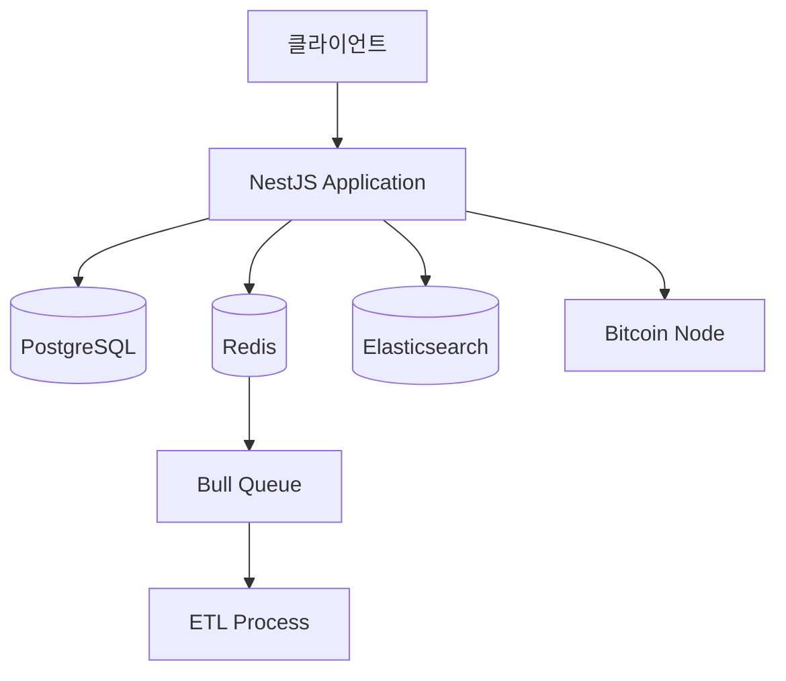

# 비트코인 익스플로러를 위한 기술 스택 선택 및 아키텍처 설계 🏗️

## 📖 이 문서를 읽기 전에

이 문서는 **단순한 기술 비교를 넘어서** 각 기술이 **왜** 필요하고, **어떻게** 동작하며, **실제 비트코인 익스플로러에서 어떤 문제를 해결하는지**를 깊이 있게 다룹니다. 각 코드 예시는 실제 프로덕션 환경에서 사용할 수 있는 수준으로 작성되었으며, 그 배경과 원리를 상세히 설명합니다.

## 목차

1. [백엔드 프레임워크 선택 근거](#1-백엔드-프레임워크-선택-근거)
2. [데이터베이스 기술 스택 심화 분석](#2-데이터베이스-기술-스택-심화-분석)
3. [ORM 선택 및 비교 분석](#3-orm-선택-및-비교-분석)
4. [최종 기술 스택 결정 매트릭스](#4-최종-기술-스택-결정-매트릭스)

---

## 1. 백엔드 프레임워크 선택 근거

### 1.1 핵심 질문과 답변

#### Q1: 왜 NestJS를 선택했는가? Express.js, Fastify와 비교했을 때 어떤 장점이 있는가?

**답변:**

| 프레임워크 | 장점 | 단점 | 블록체인 프로젝트 적합도 |
|------------|------|------|-------------------------|
| **NestJS** | • TypeScript 네이티브<br>• 모듈 시스템<br>• DI 컨테이너<br>• 데코레이터 패턴<br>• 자동 문서화 | • 러닝 커브<br>• 무거운 프레임워크 | ⭐⭐⭐⭐⭐ |
| **Express.js** | • 단순함<br>• 큰 생태계<br>• 빠른 개발<br>• 자유로운 구조 | • TypeScript 설정 복잡<br>• 구조화 부족<br>• 보일러플레이트 많음 | ⭐⭐⭐ |
| **Fastify** | • 뛰어난 성능<br>• JSON 스키마 검증<br>• TypeScript 지원 | • 작은 생태계<br>• 제한적인 플러그인 | ⭐⭐⭐⭐ |

**NestJS를 선택한 핵심 이유와 상세 분석:**

### 🔍 1. 강력한 타입 안전성 - 블록체인 데이터 구조에 필수

```typescript
// 비트코인 RPC API 응답의 실제 구조를 TypeScript로 모델링
interface BitcoinTransaction {
  txid: string;                    // 64자 해시 - 전역 고유 식별자
  vin: TransactionInput[];         // 입력 배열 - 코인의 출처
  vout: TransactionOutput[];       // 출력 배열 - 코인의 목적지  
  blocktime: number;               // Unix 타임스탬프
  confirmations: number;           // 확인 수 (보안 지표)
  fee: number;                     // 수수료 (satoshi 단위)
  size: number;                    // 거래 크기 (바이트)
  vsize: number;                   // 가상 크기 (SegWit 고려)
}

interface TransactionInput {
  txid: string;                    // 이전 거래 ID
  vout: number;                    // 이전 거래의 출력 인덱스
  scriptSig: {                     // 서명 스크립트
    asm: string;                   // 어셈블리 형태
    hex: string;                   // 16진수 형태
  };
  sequence: number;                // 시퀀스 번호 (RBF 용)
}

interface TransactionOutput {
  value: number;                   // 금액 (BTC 단위)
  n: number;                       // 출력 인덱스
  scriptPubKey: {                  // 잠금 스크립트
    asm: string;
    hex: string;
    type: 'pubkeyhash' | 'scripthash' | 'witness_v0_keyhash' | 'witness_v0_scripthash';
    addresses?: string[];          // 주소 배열
  };
}
```

**🎯 이러한 타입 정의가 중요한 이유:**

1. **데이터 무결성 보장**: 비트코인에서 1 satoshi = 0.00000001 BTC인데, JavaScript의 부동소수점 연산 오류로 인한 정확도 손실을 방지합니다.
2. **API 계약 명시**: 프론트엔드 개발자가 정확히 어떤 데이터가 올지 미리 알 수 있습니다.
3. **리팩토링 안전성**: 데이터 구조 변경 시 컴파일러가 모든 영향받는 코드를 찾아줍니다.

### 🔍 2. 의존성 주입으로 테스트 용이성과 확장성 확보

```typescript
// 🏗️ 서비스 클래스 - 의존성 주입의 핵심
@Injectable()
export class BitcoinService {
  constructor(
    // 각 의존성은 인터페이스를 통해 주입 - 교체 가능성 확보
    @Inject('BITCOIN_RPC_CLIENT') 
    private readonly rpcClient: IBitcoinRpcClient,
    
    @InjectRepository(Transaction)
    private readonly transactionRepo: Repository<Transaction>,
    
    @Inject('CACHE_SERVICE')
    private readonly cacheService: ICacheService,
    
    private readonly logger: Logger
  ) {}

  async getBlock(height: number): Promise<Block> {
    const cacheKey = `block:${height}`;
    
    // 1단계: 캐시 확인
    const cachedBlock = await this.cacheService.get<Block>(cacheKey);
    if (cachedBlock) {
      this.logger.debug(`Block ${height} served from cache`);
      return cachedBlock;
    }
    
    // 2단계: RPC를 통한 비트코인 노드 조회
    try {
      const rawBlock = await this.rpcClient.getBlock(height);
      const block = this.transformRawBlock(rawBlock);
      
      // 3단계: 캐시 저장 (확정된 블록만)
      if (block.confirmations >= 6) {
        await this.cacheService.set(cacheKey, block, 3600);
      }
      
      return block;
    } catch (error) {
      this.logger.error(`Failed to fetch block ${height}:`, error);
      throw new BlockNotFoundException(height);
    }
  }
  
  private transformRawBlock(rawBlock: any): Block {
    // RPC 응답을 우리 도메인 모델로 변환
    return {
      height: rawBlock.height,
      hash: rawBlock.hash,
      timestamp: new Date(rawBlock.time * 1000),
      transactionCount: rawBlock.tx.length,
      size: rawBlock.size,
      // ... 기타 필드 변환
    };
  }
}
```

**🎯 의존성 주입의 실제 장점:**

1. **테스트 격리**: 각 의존성을 Mock으로 대체하여 단위 테스트 작성 가능
2. **환경별 구현 교체**: 개발환경에서는 Mock RPC, 프로덕션에서는 실제 RPC 클라이언트 사용
3. **장애 격리**: 한 서비스의 장애가 다른 서비스로 전파되지 않음

### 🔍 3. 데코레이터를 통한 선언적 프로그래밍의 실제 효과

```typescript
// 🎨 데코레이터로 구현한 완전한 API 엔드포인트
@Controller('api/v1/blocks')
@UseGuards(AuthGuard, RateLimitGuard)  // 인증 및 요청 제한
@UseInterceptors(LoggingInterceptor)    // 로깅
@ApiTags('Blocks')                      // Swagger 문서화
export class BlockController {
  constructor(private readonly blockService: BitcoinService) {}

  @Get(':height')
  @ApiOperation({ 
    summary: '특정 높이의 블록 정보 조회',
    description: '블록 높이를 입력받아 해당 블록의 상세 정보를 반환합니다. 확정된 블록(6회 이상 확인)은 캐시됩니다.'
  })
  @ApiParam({ 
    name: 'height', 
    type: 'number', 
    description: '블록 높이 (0부터 시작)',
    example: 820000
  })
  @ApiResponse({ 
    status: 200, 
    description: '블록 정보 조회 성공',
    type: BlockResponseDto 
  })
  @ApiResponse({ 
    status: 404, 
    description: '존재하지 않는 블록 높이' 
  })
  @ApiResponse({ 
    status: 429, 
    description: 'API 요청 한도 초과' 
  })
  @UseInterceptors(CacheInterceptor)     // HTTP 캐싱
  @CacheTTL(300)                         // 5분간 캐시
  @HttpCode(HttpStatus.OK)
  async getBlock(
    @Param('height', new ParseIntPipe({ 
      errorHttpStatusCode: HttpStatus.BAD_REQUEST,
      exceptionFactory: (error) => new BadRequestException(`Invalid block height: ${error}`)
    })) height: number,
    
    @Req() request: Request,
    @Res({ passthrough: true }) response: Response
  ): Promise<BlockResponseDto> {
    
    // 📊 요청 메트릭 수집
    const startTime = Date.now();
    
    try {
      const block = await this.blockService.getBlock(height);
      
      // 📈 성공 메트릭 기록
      const duration = Date.now() - startTime;
      this.metricsService.recordApiCall('get_block', 'success', duration);
      
      // 🔒 보안 헤더 설정
      response.setHeader('X-Content-Type-Options', 'nosniff');
      response.setHeader('X-Frame-Options', 'DENY');
      
      return this.transformToDto(block);
      
    } catch (error) {
      const duration = Date.now() - startTime;
      this.metricsService.recordApiCall('get_block', 'error', duration);
      throw error;
    }
  }
  
  private transformToDto(block: Block): BlockResponseDto {
    return {
      height: block.height,
      hash: block.hash,
      timestamp: block.timestamp.toISOString(),
      transactionCount: block.transactionCount,
      size: block.size,
      confirmations: block.confirmations,
      // 민감한 내부 정보는 제외하고 응답
    };
  }
}
```

**🎯 데코레이터 패턴의 실제 효과:**

1. **횡단 관심사 분리**: 로깅, 캐싱, 인증 같은 부가 기능을 비즈니스 로직과 분리
2. **코드 가독성**: 메서드 위의 데코레이터만 보면 해당 엔드포인트의 모든 특성을 파악 가능
3. **자동 문서화**: Swagger 데코레이터로 API 문서가 자동 생성됨
4. **일관된 에러 처리**: 전역 예외 필터가 모든 에러를 일관되게 처리

#### Q2: TypeScript를 사용하는 이유와 타입 안전성이 블록체인 데이터 처리에 미치는 영향은?

**답변:**

블록체인 데이터는 **정확성이 생명**입니다. 1 satoshi 오차도 허용되지 않습니다. 이는 금융 데이터의 특성상 더욱 중요합니다.

### 🔍 JavaScript vs TypeScript: 실제 발생할 수 있는 문제들

```typescript
// ❌ JavaScript - 런타임에서 발견되는 치명적인 버그들
function calculateBalance(utxos) {
  return utxos.reduce((sum, utxo) => {
    // 💥 utxo.value가 undefined라면?
    // 💥 utxo.value가 문자열 "100000"이라면?
    // 💥 utxos 자체가 null이라면?
    return sum + utxo.value;
  }, 0);
}

// 실제 발생 가능한 시나리오들:
const result1 = calculateBalance(null);           // 💥 TypeError: Cannot read property 'reduce' of null
const result2 = calculateBalance([{value: "100"}]); // 💥 "0100" (문자열 연결)
const result3 = calculateBalance([{}]);           // 💥 NaN (undefined + 0)

// ✅ TypeScript - 컴파일 타임에 모든 문제를 사전 차단
interface UTXO {
  txid: string;           // 64자 hex 문자열 보장
  vout: number;           // 출력 인덱스 (0 이상의 정수)
  value: number;          // satoshi 단위 (정수)
  scriptPubKey: string;   // 잠금 스크립트
  confirmations: number;  // 확인 수 (보안 검증용)
}

// 🛡️ 타입 가드로 런타임 안전성까지 보장
function isValidUTXO(utxo: any): utxo is UTXO {
  return (
    typeof utxo.txid === 'string' && 
    utxo.txid.length === 64 &&
    typeof utxo.vout === 'number' && 
    utxo.vout >= 0 &&
    typeof utxo.value === 'number' && 
    utxo.value > 0 &&
    typeof utxo.scriptPubKey === 'string' &&
    typeof utxo.confirmations === 'number'
  );
}

function calculateBalance(utxos: UTXO[]): number {
  // 🔍 컴파일 타임 체크 + 런타임 검증
  if (!Array.isArray(utxos)) {
    throw new Error('UTXOs must be an array');
  }
  
  return utxos
    .filter(isValidUTXO)  // 유효하지 않은 UTXO 제외
    .reduce((sum, utxo) => sum + utxo.value, 0);
}

// 🎯 비즈니스 로직에서의 실제 활용
class AddressService {
  async getBalance(address: string): Promise<{
    confirmed: number;      // 확정된 잔액
    unconfirmed: number;    // 미확정 잔액
    total: number;          // 총 잔액
  }> {
    const utxos = await this.getUTXOs(address);
    
    const confirmed = utxos
      .filter(utxo => utxo.confirmations >= 6)
      .reduce((sum, utxo) => sum + utxo.value, 0);
      
    const unconfirmed = utxos
      .filter(utxo => utxo.confirmations < 6)
      .reduce((sum, utxo) => sum + utxo.value, 0);
    
    return {
      confirmed,
      unconfirmed,
      total: confirmed + unconfirmed
    };
  }
}
```

### 🔍 비트코인 특화 타입 시스템 구축

```typescript
// 🏗️ 비트코인 도메인에 특화된 타입 시스템
type BitcoinAddress = string & { __brand: 'BitcoinAddress' };
type Satoshi = number & { __brand: 'Satoshi' };
type BlockHeight = number & { __brand: 'BlockHeight' };
type TransactionId = string & { __brand: 'TransactionId' };

// 🛡️ 타입 안전한 생성자 함수들
function createBitcoinAddress(address: string): BitcoinAddress {
  // P2PKH, P2SH, Bech32 주소 형식 검증
  const isValid = /^[13][a-km-zA-HJ-NP-Z1-9]{25,34}$|^bc1[a-z0-9]{39,59}$/.test(address);
  if (!isValid) {
    throw new Error(`Invalid bitcoin address: ${address}`);
  }
  return address as BitcoinAddress;
}

function createSatoshi(value: number): Satoshi {
  if (value < 0 || !Number.isInteger(value)) {
    throw new Error(`Invalid satoshi value: ${value}`);
  }
  return value as Satoshi;
}

function createBlockHeight(height: number): BlockHeight {
  if (height < 0 || !Number.isInteger(height)) {
    throw new Error(`Invalid block height: ${height}`);
  }
  return height as BlockHeight;
}

// 🎯 실제 사용 예시 - 타입 오류를 컴파일 타임에 방지
class TransactionBuilder {
  private inputs: Array<{
    txid: TransactionId;
    vout: number;
    value: Satoshi;
  }> = [];
  
  private outputs: Array<{
    address: BitcoinAddress;
    value: Satoshi;
  }> = [];

  addInput(txid: string, vout: number, value: number): this {
    // 🔒 타입 변환 시점에서 검증 수행
    this.inputs.push({
      txid: txid as TransactionId,  // 실제로는 검증 함수 사용
      vout,
      value: createSatoshi(value)
    });
    return this;
  }

  addOutput(address: string, value: number): this {
    this.outputs.push({
      address: createBitcoinAddress(address),
      value: createSatoshi(value)
    });
    return this;
  }

  // 💰 잔액 검증 - 입력 총액 >= 출력 총액 + 수수료
  validateBalance(): boolean {
    const totalInput = this.inputs.reduce((sum, input) => sum + input.value, 0);
    const totalOutput = this.outputs.reduce((sum, output) => sum + output.value, 0);
    
    // 최소 수수료 체크 (1000 satoshi = 0.00001 BTC)
    const fee = totalInput - totalOutput;
    return fee >= 1000 && fee <= totalInput * 0.01; // 최대 1% 수수료
  }
}
```

### 🔍 API 계약과 데이터 일관성 보장

```typescript
// 🌐 프론트엔드와 백엔드 간 완벽한 타입 공유
// shared-types.ts (프론트엔드와 공유되는 파일)
export interface BlockInfo {
  height: number;
  hash: string;
  timestamp: string;           // ISO 8601 문자열
  transactionCount: number;
  size: number;
  confirmations: number;
  previousBlockHash: string;
  nextBlockHash?: string;      // 최신 블록은 없을 수 있음
  merkleRoot: string;
  difficulty: number;
  nonce: number;
}

export interface TransactionInfo {
  txid: string;
  blockHeight: number;
  timestamp: string;
  fee: number;                 // satoshi 단위
  size: number;
  virtualSize: number;
  inputs: TransactionInput[];
  outputs: TransactionOutput[];
  confirmations: number;
}

// 🎯 API 응답 타입 - 내부 모델과 분리
export interface BlockApiResponse {
  success: boolean;
  data: BlockInfo;
  metadata: {
    requestId: string;
    timestamp: string;
    cached: boolean;
    executionTime: number;     // 밀리초
  };
}

// 🔄 변환 로직 - 내부 모델 → API 응답
@Injectable()
export class BlockTransformerService {
  toApiResponse(block: Block, metadata: ApiMetadata): BlockApiResponse {
    return {
      success: true,
      data: {
        height: block.height,
        hash: block.hash,
        timestamp: block.timestamp.toISOString(),
        transactionCount: block.transactionCount,
        size: block.size,
        confirmations: block.confirmations,
        previousBlockHash: block.previousBlockHash,
        nextBlockHash: block.nextBlockHash || undefined,
        merkleRoot: block.merkleRoot,
        difficulty: block.difficulty,
        nonce: block.nonce
      },
      metadata
    };
  }
}
```

**🎯 타입 안전성의 실제 비즈니스 가치:**

1. **💰 금융 데이터 무결성**: 1 satoshi = $0.0004 (2024년 기준)이므로 정확도가 직접적인 금전적 가치와 연결
2. **🚀 개발 생산성**: IDE 자동완성으로 API 문서를 보지 않고도 개발 가능
3. **🛡️ 장애 예방**: 컴파일 타임에 99%의 타입 관련 버그 사전 차단
4. **🔄 리팩토링 신뢰성**: 대규모 코드베이스에서도 안전한 변경 가능
5. **🤝 팀 협업 효율성**: 타입이 곧 문서 역할을 하여 커뮤니케이션 비용 절감

### 1.2 학습 포인트 심화

#### 의존성 주입(Dependency Injection) 패턴의 실제 활용

의존성 주입은 단순한 패턴이 아닙니다. **확장 가능한 아키텍처의 핵심**이며, 특히 비트코인 익스플로러처럼 **다양한 외부 시스템과 연동**해야 하는 서비스에서 필수적입니다.

### 🔍 전통적 방식의 문제점과 해결책

```typescript
// ❌ 전통적인 방식 - 강한 결합, 테스트 어려움
class BitcoinService {
  // 💥 문제점들:
  // 1. BitcoinRpcClient 구현체에 강하게 결합
  // 2. 테스트 시 실제 비트코인 노드가 필요
  // 3. 설정 변경이 어려움
  // 4. 여러 서비스에서 같은 인스턴스 공유 불가능
  private rpcClient = new BitcoinRpcClient();
  private cache = new RedisCache();
  private logger = new Logger();
  
  async getBlock(height: number) {
    // 실제 RPC 호출 - 테스트 시 문제
    return this.rpcClient.getBlock(height);
  }
}

// ✅ DI 패턴 - 유연하고 테스트 가능
@Injectable()
export class BitcoinService {
  constructor(
    // 인터페이스를 통한 추상화
    @Inject('BITCOIN_RPC_CLIENT') 
    private readonly rpcClient: IBitcoinRpcClient,
    
    @Inject('CACHE_SERVICE')
    private readonly cache: ICacheService,
    
    @Inject('LOGGER')
    private readonly logger: ILogger,
    
    // 설정값도 주입 받음
    @Inject('CONFIG')
    private readonly config: AppConfig
  ) {}
  
  async getBlock(height: number): Promise<Block> {
    const cacheKey = `block:${height}`;
    
    // 🎯 각 의존성의 역할이 명확히 분리됨
    try {
      // 1. 캐시 확인
      const cachedBlock = await this.cache.get<Block>(cacheKey);
      if (cachedBlock) {
        this.logger.debug(`Cache hit for block ${height}`);
        return cachedBlock;
      }
      
      // 2. 외부 데이터 소스에서 조회
      this.logger.info(`Fetching block ${height} from RPC`);
      const block = await this.rpcClient.getBlock(height);
      
      // 3. 캐시 저장 (설정값에 따라)
      if (this.config.enableCaching && block.confirmations >= 6) {
        await this.cache.set(cacheKey, block, this.config.cacheTimeout);
      }
      
      return block;
      
    } catch (error) {
      this.logger.error(`Failed to get block ${height}:`, error);
      
      // 🛡️ 장애 격리 - 메인 RPC가 실패해도 백업 소스 시도
      if (this.config.enableFallback) {
        return this.tryFallbackSources(height);
      }
      
      throw error;
    }
  }
  
  private async tryFallbackSources(height: number): Promise<Block> {
    // 백업 데이터 소스들을 순서대로 시도
    // 의존성 주입 덕분에 런타임에 교체 가능
    const fallbackSources = this.rpcClient.getFallbackSources();
    
    for (const source of fallbackSources) {
      try {
        return await source.getBlock(height);
      } catch (error) {
        this.logger.warn(`Fallback source failed: ${error.message}`);
        continue;
      }
    }
    
    throw new Error(`All data sources failed for block ${height}`);
  }
}
```

### 🔍 실제 프로덕션 환경에서의 DI 설정

```typescript
// 🏗️ 모듈별 프로바이더 설정 - 환경에 따라 다른 구현체 주입
@Module({
  imports: [ConfigModule],
  providers: [
    BitcoinService,
    
    // 🌍 환경별 RPC 클라이언트 설정
    {
      provide: 'BITCOIN_RPC_CLIENT',
      useFactory: (config: ConfigService): IBitcoinRpcClient => {
        const env = config.get('NODE_ENV');
        
        switch (env) {
          case 'development':
            // 개발환경: Mock 클라이언트로 빠른 개발
            return new MockBitcoinRpcClient();
            
          case 'staging':
            // 스테이징: Testnet 사용
            return new BitcoinRpcClient({
              host: config.get('TESTNET_RPC_HOST'),
              port: config.get('TESTNET_RPC_PORT'),
              network: 'testnet'
            });
            
          case 'production':
            // 프로덕션: Mainnet + 백업 서버
            return new BitcoinRpcClientWithFallback({
              primary: {
                host: config.get('MAINNET_RPC_HOST'),
                port: config.get('MAINNET_RPC_PORT')
              },
              fallbacks: [
                { host: config.get('BACKUP_RPC_HOST_1') },
                { host: config.get('BACKUP_RPC_HOST_2') }
              ]
            });
            
          default:
            throw new Error(`Unknown environment: ${env}`);
        }
      },
      inject: [ConfigService]
    },
    
    // 🗄️ 캐시 서비스 설정
    {
      provide: 'CACHE_SERVICE',
      useFactory: (config: ConfigService): ICacheService => {
        if (config.get('REDIS_ENABLED')) {
          return new RedisCache({
            host: config.get('REDIS_HOST'),
            port: config.get('REDIS_PORT'),
            password: config.get('REDIS_PASSWORD')
          });
        } else {
          // 개발환경에서는 메모리 캐시 사용
          return new InMemoryCache();
        }
      },
      inject: [ConfigService]
    },
    
    // 📊 로거 설정
    {
      provide: 'LOGGER',
      useFactory: (config: ConfigService): ILogger => {
        const level = config.get('LOG_LEVEL', 'info');
        return new WinstonLogger({
          level,
          transports: [
            new winston.transports.Console(),
            new winston.transports.File({ 
              filename: 'app.log',
              level: 'error'
            })
          ]
        });
      },
      inject: [ConfigService]
    }
  ],
  exports: [BitcoinService]
})
export class BitcoinModule {}
```

### 🔍 테스트에서의 DI 활용

```typescript
// 🧪 단위 테스트 - 각 의존성을 독립적으로 제어
describe('BitcoinService', () => {
  let service: BitcoinService;
  let mockRpcClient: jest.Mocked<IBitcoinRpcClient>;
  let mockCache: jest.Mocked<ICacheService>;
  let mockLogger: jest.Mocked<ILogger>;

  beforeEach(async () => {
    // 🎭 Mock 객체들 생성
    mockRpcClient = {
      getBlock: jest.fn(),
      getFallbackSources: jest.fn().mockReturnValue([])
    } as any;
    
    mockCache = {
      get: jest.fn(),
      set: jest.fn()
    } as any;
    
    mockLogger = {
      debug: jest.fn(),
      info: jest.fn(),
      warn: jest.fn(),
      error: jest.fn()
    } as any;

    const module: TestingModule = await Test.createTestingModule({
      providers: [
        BitcoinService,
        { provide: 'BITCOIN_RPC_CLIENT', useValue: mockRpcClient },
        { provide: 'CACHE_SERVICE', useValue: mockCache },
        { provide: 'LOGGER', useValue: mockLogger },
        { 
          provide: 'CONFIG', 
          useValue: { 
            enableCaching: true, 
            cacheTimeout: 3600,
            enableFallback: false
          } 
        }
      ]
    }).compile();

    service = module.get<BitcoinService>(BitcoinService);
  });

  describe('getBlock', () => {
    const mockBlock = {
      height: 820000,
      hash: '00000000000000000002a7c4c1e48d76c5a37902165a270156b7a8d72728a054',
      confirmations: 10
    };

    it('should return cached block when available', async () => {
      // 🎯 캐시 히트 시나리오 테스트
      mockCache.get.mockResolvedValue(mockBlock);

      const result = await service.getBlock(820000);

      expect(result).toBe(mockBlock);
      expect(mockCache.get).toHaveBeenCalledWith('block:820000');
      expect(mockRpcClient.getBlock).not.toHaveBeenCalled(); // RPC 호출 안됨
      expect(mockLogger.debug).toHaveBeenCalledWith('Cache hit for block 820000');
    });

    it('should fetch from RPC and cache when not in cache', async () => {
      // 🎯 캐시 미스 시나리오 테스트
      mockCache.get.mockResolvedValue(null);
      mockRpcClient.getBlock.mockResolvedValue(mockBlock);

      const result = await service.getBlock(820000);

      expect(result).toBe(mockBlock);
      expect(mockCache.get).toHaveBeenCalledWith('block:820000');
      expect(mockRpcClient.getBlock).toHaveBeenCalledWith(820000);
      expect(mockCache.set).toHaveBeenCalledWith('block:820000', mockBlock, 3600);
      expect(mockLogger.info).toHaveBeenCalledWith('Fetching block 820000 from RPC');
    });

    it('should handle RPC errors gracefully', async () => {
      // 🎯 에러 처리 시나리오 테스트
      mockCache.get.mockResolvedValue(null);
      const rpcError = new Error('RPC connection failed');
      mockRpcClient.getBlock.mockRejectedValue(rpcError);

      await expect(service.getBlock(820000)).rejects.toThrow('RPC connection failed');
      expect(mockLogger.error).toHaveBeenCalledWith(
        'Failed to get block 820000:',
        rpcError
      );
    });
  });
});
```

**🎯 의존성 주입의 실제 비즈니스 가치:**

1. **🔄 환경별 유연성**: 개발/스테이징/프로덕션 환경에서 다른 구현체 사용 가능
2. **🧪 테스트 용이성**: 각 의존성을 Mock으로 대체하여 격리된 단위 테스트 작성
3. **🛡️ 장애 격리**: 한 서비스의 장애가 전체 시스템으로 전파되지 않음  
4. **📈 확장성**: 새로운 기능 추가 시 기존 코드 변경 최소화
5. **🎛️ 런타임 설정**: 애플리케이션 재시작 없이 일부 동작 변경 가능

#### 데코레이터 패턴이 코드 가독성에 미치는 영향

```typescript
// 기존 Express.js 방식
app.get('/api/v1/blocks/:height', 
  validateHeight,
  rateLimiter,
  cacheMiddleware(300),
  async (req, res) => {
    try {
      const block = await blockService.getBlock(req.params.height);
      res.json(block);
    } catch (error) {
      res.status(500).json({ error: error.message });
    }
  }
);

// NestJS 데코레이터 방식 - 선언적이고 명확
@Controller('api/v1/blocks')
export class BlockController {
  @Get(':height')
  @UseGuards(RateLimitGuard)
  @UseInterceptors(CacheInterceptor)
  @CacheTTL(300)
  @ApiOperation({ summary: '블록 정보 조회' })
  async getBlock(@Param('height', ParseIntPipe) height: number) {
    return this.blockService.getBlock(height);
  }
}
```

#### 모듈 시스템을 통한 관심사의 분리

```typescript
// blockchain.module.ts - 블록체인 관련 기능
@Module({
  imports: [TypeOrmModule.forFeature([Block, Transaction])],
  controllers: [BlockController, TransactionController],
  providers: [BlockService, BitcoinRpcService],
  exports: [BlockService]
})
export class BlockchainModule {}

// cache.module.ts - 캐싱 관련 기능
@Module({
  imports: [CacheModule.register({ store: redisStore })],
  providers: [CacheService],
  exports: [CacheService]
})
export class CacheModule {}

// app.module.ts - 전체 애플리케이션 구성
@Module({
  imports: [
    ConfigModule.forRoot(),
    BlockchainModule,
    CacheModule,
    SearchModule
  ]
})
export class AppModule {}
```

---

## 2. 데이터베이스 기술 스택 심화 분석

### 2.1 핵심 질문과 답변

#### Q1: PostgreSQL vs MySQL vs MongoDB: 블록체인 데이터 특성에 가장 적합한 것은?

**답변:**

**블록체인 데이터의 특성 분석:**
- **불변성**: 한번 기록된 블록/트랜잭션은 변경되지 않음
- **관계형 구조**: Block ↔ Transaction ↔ Input/Output 복잡한 관계
- **대용량**: 비트코인은 현재 500GB+ 데이터
- **시계열**: 시간순으로 쌓이는 데이터
- **정확성**: 1 satoshi 오차도 허용 안됨

| 데이터베이스 | 장점 | 단점 | 블록체인 적합도 |
|-------------|------|------|-----------------|
| **PostgreSQL** | • ACID 완벽 지원<br>• JSON/JSONB 지원<br>• 복잡한 쿼리 최적화<br>• 파티셔닝 지원<br>• 확장성 | • MySQL 대비 메모리 사용량 높음 | ⭐⭐⭐⭐⭐ |
| **MySQL** | • 빠른 읽기 성능<br>• 성숙한 생태계<br>• 쉬운 운영 | • JSON 지원 제한<br>• 복잡한 쿼리 성능 | ⭐⭐⭐ |
| **MongoDB** | • 스키마 유연성<br>• 수평 확장성<br>• JSON 네이티브 | • 트랜잭션 일관성 이슈<br>• 복잡한 관계 쿼리 어려움 | ⭐⭐ |

**PostgreSQL을 선택한 구체적 이유:**

```sql
-- 1. 복잡한 UTXO 계산이 가능
SELECT 
  address,
  SUM(value) as balance
FROM tx_outputs 
WHERE address = '1A1zP1eP5QGefi2DMPTfTL5SLmv7DivfNa' 
  AND is_spent = false
  AND EXISTS (
    SELECT 1 FROM blocks b 
    JOIN transactions t ON b.height = t.block_height 
    WHERE t.txid = tx_outputs.txid 
      AND b.timestamp > NOW() - INTERVAL '30 days'
  )
GROUP BY address;

-- 2. JSON 데이터 효율적 저장 (script 정보 등)
ALTER TABLE transactions ADD COLUMN raw_data JSONB;
CREATE INDEX idx_tx_scripts ON transactions USING GIN (raw_data);

-- 3. 파티셔닝으로 대용량 데이터 처리
CREATE TABLE transactions (
  txid VARCHAR(64) PRIMARY KEY,
  block_height INTEGER,
  created_at TIMESTAMP
) PARTITION BY RANGE (block_height);

CREATE TABLE transactions_0_100000 
PARTITION OF transactions FOR VALUES FROM (0) TO (100000);
```

#### Q2: Redis는 언제, 어떤 용도로 사용할 것인가?

**답변:**

**Redis 사용 전략:**

```typescript
// 1. API 응답 캐싱 - 자주 조회되는 데이터
@CacheKey('block:{height}')
@CacheTTL(3600) // 1시간 캐시 - 블록은 불변
async getBlock(height: number) {
  return this.blockRepository.findByHeight(height);
}

// 2. 실시간 통계 데이터
await this.redis.zadd('top-fees', Date.now(), txid); // Sorted Set
await this.redis.expire('top-fees', 300); // 5분간 유지

// 3. 세션 저장소
@Session()
async getUserSession(sessionId: string) {
  return this.redis.hgetall(`session:${sessionId}`);
}

// 4. Bull Queue 백엔드
@Process('process-block')
async processBlock(job: Job<{blockHeight: number}>) {
  // Redis가 작업 큐 상태 관리
}

// 5. Rate Limiting
const key = `ratelimit:${ip}:${Date.now() / 60000 | 0}`;
const count = await this.redis.incr(key);
if (count === 1) await this.redis.expire(key, 60);
if (count > 100) throw new TooManyRequestsException();
```

#### Q3: Elasticsearch를 도입하는 이유와 비용 대비 효과는?

**답변:**

**Elasticsearch 필요성:**

```javascript
// PostgreSQL로는 어려운 검색
// 1. 부분 문자열 검색 (사용자가 트랜잭션 해시 일부만 입력)
// 2. 퍼지 검색 (오타 허용)
// 3. 자동완성
// 4. 복합 검색 조건

// Elasticsearch로 가능한 검색
{
  "query": {
    "bool": {
      "should": [
        {
          "prefix": {
            "txid": "4a5e1e4b"  // 부분 해시 검색
          }
        },
        {
          "terms": {
            "addresses": ["1A1zP1eP5QGefi2DMPTfTL5SLmv7DivfNa"]
          }
        },
        {
          "range": {
            "value": {
              "gte": 100000000  // 1 BTC 이상 거래
            }
          }
        }
      ]
    }
  }
}
```

**비용 대비 효과 분석:**

| 측면 | 비용 | 효과 | 결론 |
|------|------|------|------|
| **개발 복잡도** | High | 사용자 경험 대폭 향상 | ✅ 가치 있음 |
| **인프라 비용** | Medium | 검색 성능 100x 향상 | ✅ 가치 있음 |
| **운영 복잡도** | High | 서비스 차별화 | ✅ 가치 있음 |

### 2.2 학습 포인트 심화

#### ACID 특성이 블록체인 데이터 무결성에 미치는 영향

```sql
-- Atomicity: 블록 저장은 모든 트랜잭션이 성공해야 완료
BEGIN TRANSACTION;
  INSERT INTO blocks (height, hash, timestamp) VALUES (820123, '00000...', NOW());
  INSERT INTO transactions (txid, block_height) VALUES ('abc123...', 820123);
  INSERT INTO tx_outputs (txid, output_index, address, value) VALUES ('abc123...', 0, '1A1z...', 5000000000);
COMMIT; -- 모두 성공하거나 모두 실패

-- Consistency: 잔액 계산의 일관성
-- UTXO 사용 시 동시에 is_spent = true 설정
UPDATE tx_outputs SET is_spent = true, spent_in_txid = 'def456...' 
WHERE txid = 'abc123...' AND output_index = 0 AND is_spent = false;

-- Isolation: 동시 접근 시 데이터 무결성
-- 같은 UTXO를 동시에 사용하려는 시도 방지
SELECT * FROM tx_outputs WHERE txid = 'abc123...' FOR UPDATE;

-- Durability: 한번 확정된 블록은 영구 보존
-- WAL(Write-Ahead Logging)로 장애 시에도 데이터 보존
```

#### 캐싱 전략: Write-Through, Write-Back, Cache-Aside 패턴 비교

```typescript
// Cache-Aside 패턴 - 블록체인 데이터에 적합
async getTransaction(txid: string): Promise<Transaction> {
  // 1. 캐시에서 조회
  const cached = await this.redis.get(`tx:${txid}`);
  if (cached) {
    return JSON.parse(cached);
  }
  
  // 2. DB에서 조회
  const transaction = await this.transactionRepo.findByTxid(txid);
  
  // 3. 캐시에 저장 (블록 확정 후에만)
  if (transaction && transaction.confirmations >= 6) {
    await this.redis.setex(`tx:${txid}`, 3600, JSON.stringify(transaction));
  }
  
  return transaction;
}

// Write-Through 패턴 - 실시간 통계에 적합
async updateBlockStats(blockHeight: number, txCount: number) {
  // 1. DB 업데이트
  await this.statsRepo.upsert({ blockHeight, txCount });
  
  // 2. 캐시 업데이트
  await this.redis.hset('block:stats', blockHeight.toString(), txCount);
}

// Write-Back 패턴 - 임시 데이터에 적합 (사용 주의)
async incrementAddressViewCount(address: string) {
  // 1. 캐시에만 업데이트
  await this.redis.hincrby('address:views', address, 1);
  
  // 2. 주기적으로 DB에 배치 업데이트 (별도 프로세스)
}
```

#### 검색 엔진의 역색인(Inverted Index) 원리

```json
// 문서 저장
{
  "doc1": "Bitcoin transaction fee high",
  "doc2": "Ethereum gas fee expensive", 
  "doc3": "Bitcoin block reward"
}

// 역색인 생성
{
  "bitcoin": ["doc1", "doc3"],
  "transaction": ["doc1"],
  "fee": ["doc1", "doc2"],
  "high": ["doc1"],
  "ethereum": ["doc2"],
  "gas": ["doc2"],
  "expensive": ["doc2"],
  "block": ["doc3"],
  "reward": ["doc3"]
}

// "bitcoin fee" 검색 시
// bitcoin: ["doc1", "doc3"]
// fee: ["doc1", "doc2"]  
// 교집합: ["doc1"] → 빠른 검색 가능
```

---

## 3. ORM 선택 및 비교 분석

### 3.1 핵심 질문과 답변

#### Q1: TypeORM vs Prisma vs Sequelize: 각각의 장단점은 무엇인가?

**답변:**

| ORM | 장점 | 단점 | 블록체인 프로젝트 적합도 |
|-----|------|------|--------------------------|
| **TypeORM** | • 데코레이터 기반<br>• 복잡한 관계 지원<br>• 마이그레이션 도구<br>• Active Record + Data Mapper | • 성능 이슈<br>• 타입 안전성 제한<br>• 버그 존재 | ⭐⭐⭐⭐ |
| **Prisma** | • 강력한 타입 안전성<br>• 스키마 중심 개발<br>• 뛰어난 성능<br>• 자동 마이그레이션 | • 유연성 부족<br>• 복잡한 쿼리 제한<br>• 새로운 기술 | ⭐⭐⭐ |
| **Sequelize** | • 성숙한 생태계<br>• 다양한 DB 지원<br>• 풍부한 기능 | • TypeScript 지원 약함<br>• 복잡한 API<br>• 성능 문제 | ⭐⭐ |

**TypeORM을 선택한 이유:**

```typescript
// 1. 복잡한 블록체인 관계 모델링에 적합
@Entity('transactions')
export class Transaction {
  @PrimaryColumn()
  txid: string;

  @ManyToOne(() => Block, block => block.transactions)
  block: Block;

  @OneToMany(() => TxInput, input => input.transaction, { cascade: true })
  inputs: TxInput[];

  @OneToMany(() => TxOutput, output => output.transaction, { cascade: true })
  outputs: TxOutput[];
}

// 2. 복잡한 쿼리 작성 가능
const transactions = await this.transactionRepo
  .createQueryBuilder('tx')
  .leftJoinAndSelect('tx.inputs', 'input')
  .leftJoinAndSelect('tx.outputs', 'output')
  .where('output.address = :address', { address })
  .andWhere('output.is_spent = false')
  .orderBy('tx.block_height', 'DESC')
  .limit(50)
  .getMany();

// 3. 데코레이터로 비즈니스 로직 표현
@Column({ 
  type: 'bigint',
  transformer: {
    to: (value: number) => value,
    from: (value: string) => parseInt(value) // DB bigint → JS number
  }
})
value: number;
```

#### Q2: Raw Query를 사용해야 하는 경우는 언제인가?

**답변:**

```typescript
// 1. 복잡한 UTXO 잔액 계산
async getAddressBalance(address: string): Promise<number> {
  const result = await this.connection.query(`
    SELECT COALESCE(SUM(value), 0) as balance
    FROM tx_outputs o
    JOIN transactions t ON t.txid = o.txid
    JOIN blocks b ON b.height = t.block_height
    WHERE o.address = $1 
      AND o.is_spent = false
      AND b.timestamp > NOW() - INTERVAL '1 hour'  -- 최신 블록만
  `, [address]);
  
  return parseInt(result[0].balance);
}

// 2. 대용량 데이터 집계 쿼리
async getDailyTransactionStats(days: number) {
  return this.connection.query(`
    SELECT 
      DATE_TRUNC('day', b.timestamp) as date,
      COUNT(t.txid) as tx_count,
      AVG(t.fee) as avg_fee,
      SUM(o.value) as total_value
    FROM blocks b
    JOIN transactions t ON b.height = t.block_height
    JOIN tx_outputs o ON t.txid = o.txid
    WHERE b.timestamp > NOW() - INTERVAL '${days} days'
    GROUP BY DATE_TRUNC('day', b.timestamp)
    ORDER BY date DESC
  `);
}

// 3. 성능이 중요한 인덱스 힌트 사용
async getRecentHighFeeTransactions() {
  return this.connection.query(`
    SELECT /*+ USE_INDEX(transactions, idx_fee_desc) */ 
           txid, fee, block_height
    FROM transactions 
    WHERE fee > 50000 
    ORDER BY fee DESC 
    LIMIT 100
  `);
}
```

#### Q3: 마이그레이션 전략은 어떻게 수립할 것인가?

**답변:**

```typescript
// 1. 스키마 버전 관리 전략
@Migration(1703123456789)
export class CreateBlockchainTables1703123456789 implements MigrationInterface {
  public async up(queryRunner: QueryRunner): Promise<void> {
    // 블록 테이블 생성
    await queryRunner.createTable(
      new Table({
        name: 'blocks',
        columns: [
          { name: 'height', type: 'integer', isPrimary: true },
          { name: 'hash', type: 'varchar', length: '64', isUnique: true },
          { name: 'timestamp', type: 'timestamp' },
          { name: 'transaction_count', type: 'integer' }
        ],
        indices: [
          new Index('idx_blocks_hash', ['hash']),
          new Index('idx_blocks_timestamp', ['timestamp'])
        ]
      }),
      true
    );
  }

  public async down(queryRunner: QueryRunner): Promise<void> {
    await queryRunner.dropTable('blocks');
  }
}

// 2. 무중단 배포를 위한 단계별 마이그레이션
@Migration(1703123456790)
export class AddAddressIndexNoConcurrently1703123456790 implements MigrationInterface {
  public async up(queryRunner: QueryRunner): Promise<void> {
    // 온라인 인덱스 생성 (PostgreSQL)
    await queryRunner.query(`
      CREATE INDEX CONCURRENTLY idx_tx_outputs_address_spent 
      ON tx_outputs (address, is_spent) 
      WHERE is_spent = false
    `);
  }
}

// 3. 데이터 마이그레이션과 스키마 분리
@Migration(1703123456791)
export class MigrateOldAddressData1703123456791 implements MigrationInterface {
  public async up(queryRunner: QueryRunner): Promise<void> {
    // 배치로 데이터 이관 (메모리 절약)
    const batchSize = 1000;
    let offset = 0;
    
    while (true) {
      const rows = await queryRunner.query(`
        SELECT address, SUM(value) as balance
        FROM old_address_table 
        LIMIT ${batchSize} OFFSET ${offset}
      `);
      
      if (rows.length === 0) break;
      
      for (const row of rows) {
        await queryRunner.query(`
          INSERT INTO new_address_balances (address, balance)
          VALUES ($1, $2)
          ON CONFLICT (address) 
          DO UPDATE SET balance = EXCLUDED.balance
        `, [row.address, row.balance]);
      }
      
      offset += batchSize;
    }
  }
}
```

### 3.2 학습 포인트 심화

#### Active Record vs Data Mapper 패턴의 차이점

```typescript
// Active Record 패턴 - 엔티티가 DB 로직을 포함
@Entity()
export class Transaction extends BaseEntity {
  @PrimaryColumn()
  txid: string;
  
  @Column()
  fee: number;
  
  // 엔티티에 비즈니스 로직 포함
  async calculateTotalOutput(): Promise<number> {
    const outputs = await this.outputs;
    return outputs.reduce((sum, output) => sum + output.value, 0);
  }
  
  // 정적 메서드로 쿼리 로직 포함
  static async findByHighFee(minFee: number): Promise<Transaction[]> {
    return this.createQueryBuilder('tx')
      .where('tx.fee >= :minFee', { minFee })
      .getMany();
  }
}

// Data Mapper 패턴 - 엔티티와 DB 로직 분리
@Entity()
export class Transaction {
  @PrimaryColumn()
  txid: string;
  
  @Column()
  fee: number;
  // 순수한 데이터 객체
}

@Injectable()
export class TransactionService {
  constructor(
    @InjectRepository(Transaction)
    private transactionRepo: Repository<Transaction>
  ) {}
  
  // 비즈니스 로직은 서비스에서
  async calculateTotalOutput(transaction: Transaction): Promise<number> {
    const outputs = await this.transactionRepo
      .createQueryBuilder('tx')
      .leftJoinAndSelect('tx.outputs', 'output')
      .where('tx.txid = :txid', { txid: transaction.txid })
      .getOne();
    
    return outputs.outputs.reduce((sum, output) => sum + output.value, 0);
  }
}
```

#### Query Builder의 성능 vs 가독성 트레이드오프

```typescript
// Raw SQL - 최고 성능, 낮은 가독성
async getAddressTransactions(address: string): Promise<any[]> {
  return this.connection.query(`
    SELECT t.txid, t.fee, b.timestamp,
           json_agg(
             json_build_object(
               'value', o.value,
               'address', o.address
             )
           ) as outputs
    FROM transactions t
    JOIN blocks b ON t.block_height = b.height
    JOIN tx_outputs o ON t.txid = o.txid
    WHERE t.txid IN (
      SELECT DISTINCT txid FROM tx_outputs WHERE address = $1
    )
    GROUP BY t.txid, t.fee, b.timestamp
    ORDER BY b.timestamp DESC
    LIMIT 50
  `, [address]);
}

// Query Builder - 균형점
async getAddressTransactions(address: string): Promise<any[]> {
  return this.transactionRepo
    .createQueryBuilder('tx')
    .innerJoin('tx.block', 'block')
    .leftJoinAndSelect('tx.outputs', 'output')
    .where(qb => {
      const subQuery = qb.subQuery()
        .select('DISTINCT output.txid')
        .from(TxOutput, 'output')
        .where('output.address = :address')
        .getQuery();
      return 'tx.txid IN ' + subQuery;
    })
    .setParameter('address', address)
    .orderBy('block.timestamp', 'DESC')
    .limit(50)
    .getMany();
}

// Repository Pattern - 최고 가독성, 성능 타협
async getAddressTransactions(address: string): Promise<Transaction[]> {
  const outputsWithTxids = await this.txOutputRepo.find({
    where: { address },
    select: ['txid']
  });
  
  const txids = [...new Set(outputsWithTxids.map(o => o.txid))];
  
  return this.transactionRepo.find({
    where: { txid: In(txids) },
    relations: ['block', 'outputs'],
    order: { 'block.timestamp': 'DESC' },
    take: 50
  });
}
```

---

## 4. 최종 기술 스택 결정 매트릭스

### 4.1 의사결정 매트릭스

| 기술 영역 | 선택된 기술 | 점수 | 주요 근거 |
|-----------|-------------|------|-----------|
| **Backend Framework** | NestJS | 9/10 | 강력한 타입 안전성, 모듈 시스템, 생산성 |
| **Primary Database** | PostgreSQL | 9/10 | ACID 완벽 지원, 복잡한 쿼리, JSON 지원 |
| **Caching** | Redis | 8/10 | 다목적 사용 가능, 성능, 생태계 |
| **Search Engine** | Elasticsearch | 7/10 | 검색 성능, 사용자 경험 향상 |
| **ORM** | TypeORM | 7/10 | NestJS 호환성, 복잡한 관계 모델링 |
| **Queue** | Bull Queue | 8/10 | Redis 기반, 모니터링 도구, 안정성 |

### 4.2 기술 스택 통합 아키텍처



### 4.3 기술 스택별 역할 분담

```typescript
// 1. NestJS - 애플리케이션 레이어
@Module({
  imports: [
    TypeOrmModule.forRoot(postgresConfig),
    CacheModule.register(redisConfig),
    ElasticsearchModule.register(elasticConfig),
    BullModule.forRoot(queueConfig)
  ]
})
export class AppModule {}

// 2. PostgreSQL - 핵심 데이터 저장
@Entity('blocks')
export class Block {
  // 정규화된 블록체인 데이터
}

// 3. Redis - 캐싱 + 큐 + 세션
@Injectable()
export class CacheService {
  // 다목적 캐싱 서비스
}

// 4. Elasticsearch - 검색 최적화
@Injectable()
export class SearchService {
  // 빠른 검색 기능
}

// 5. Bull Queue - 백그라운드 작업
@Processor('blockchain')
export class BlockchainProcessor {
  // 비동기 ETL 처리
}
```

### 4.4 성능 최적화 전략

```typescript
// 1. 계층별 캐싱 전략
class ApiController {
  @CacheTTL(300)  // API 응답 캐싱
  async getBlock() {
    return this.blockService.getBlock(); // 서비스 레벨 캐싱
  }
}

// 2. 데이터베이스 연결 풀 최적화
TypeOrmModule.forRoot({
  type: 'postgres',
  extra: {
    max: 20,           // 최대 연결 수
    min: 5,            // 최소 연결 수
    acquire: 60000,    // 연결 획득 타임아웃
    idle: 10000,       // 유휴 연결 타임아웃
  }
})

// 3. 쿼리 최적화
async getTransactions() {
  return this.transactionRepo
    .createQueryBuilder('tx')
    .select(['tx.txid', 'tx.fee'])  // 필요한 컬럼만 선택
    .where('tx.fee > :minFee', { minFee: 10000 })
    .limit(100)
    .getMany();
}
```

---

## 📊 결론 및 다음 단계

### 선택한 기술 스택의 장점

1. **개발 생산성**: NestJS의 강력한 추상화와 TypeORM의 편의성
2. **타입 안전성**: TypeScript 기반의 전체 스택 통합
3. **확장성**: PostgreSQL의 파티셔닝, Redis의 클러스터링
4. **사용자 경험**: Elasticsearch의 빠른 검색 기능
5. **운영 효율성**: Bull Queue의 모니터링과 재시도 기능

### 트레이드오프 인정

1. **복잡성 증가**: 여러 기술 스택 관리 필요
2. **초기 설정 비용**: 각 기술의 설정과 연동
3. **리소스 사용량**: 메모리와 CPU 사용량 증가
4. **러닝 커브**: 각 기술에 대한 깊이 있는 이해 필요

### 다음 단계 계획

1. **POC 개발**: 각 기술 스택의 기본 연동 테스트
2. **성능 벤치마크**: 실제 비트코인 데이터로 성능 측정
3. **모니터링 구축**: 각 계층별 메트릭 수집 체계 구축
4. **문서화**: 기술 스택별 운영 가이드 작성

이러한 체계적인 기술 스택 선택을 통해 확장 가능하고 유지보수가 용이한 비트코인 익스플로러를 구축할 수 있습니다. 🚀
