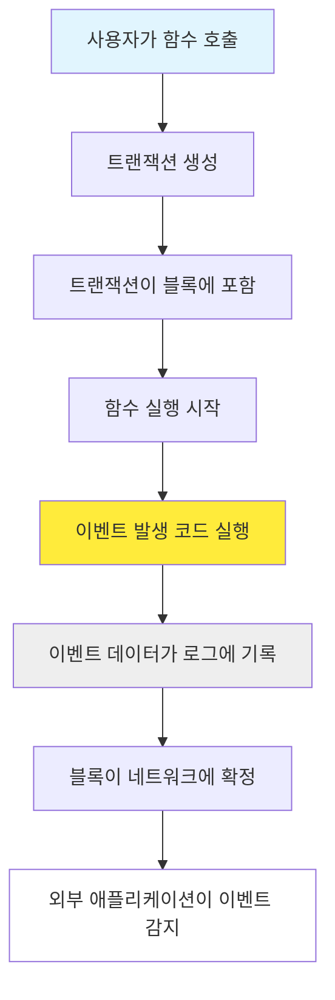
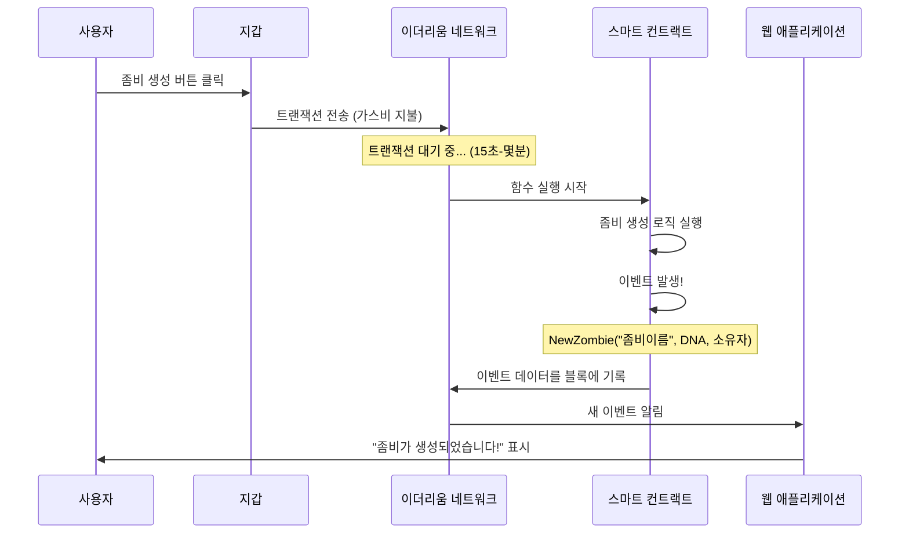

가스비는 이더리움 네트워크에서 거래나 컨트랙트 실행에 드는 수수료입니다.

### 실생활 비유로 이해하기

- **전기요금**: 컴퓨터를 오래 쓸수록 전기요금이 많이 나옴
- **택시비**: 거리가 멀수록, 복잡한 길일수록 요금이 비쌈
- **가스비**: 복잡한 계산일수록, 많은 데이터를 저장할수록 비쌈
### 가스비가 드는 이유

1. **네트워크 보안**: 스팸 공격 방지
2. **자원 할당**: 한정된 블록 공간의 공정한 분배
3. **채굴자 보상**: 거래를 처리해주는 채굴자들에게 수수료 지급
### 가스비 차이 예시

- **변수에 숫자 저장**: 20,000 gas = 약 $5-20 (이더 가격에 따라)
- **이벤트 발생**: 1,500 gas = 약 $0.5-2
- **복잡한 계산**: 100,000+ gas = 약 $25-100+

