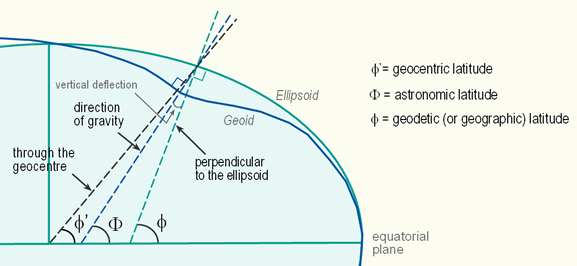

## 연직선편차 (Deflection of the Vertical)
### 개념
지구 타원체상의 임의의 점에 대한 법선인 수직선과 이를 통과하는 연직선 사이의 각을 연직선편차 라고 합니다.

### 발생 원인

- 타원체 법선: 수학적으로 정의된 기준타원체에 수직인 선
- 지오이드 법선(연직선): 실제 중력 방향에 수직인 선

이 둘이 일치하지 않아 편차가 발생합니다.

연직선편차의 관측으로 임의의 점에서 지오이드면과 기준타원체의 경사를 알 수 있어 기복결정이 가능합니다.

## 기복결정

### 개념
"기복" 은 지오이드면의 오르내림, 즉 지오이드의 높낮이(undulation)를 의미합니다.

### 쉬운 설명

- 기준타원체: 매끄러운 달걀 모양 (수학적으로 깔끔한 면)
- 지오이드: 울퉁불퉁한 면 (실제 중력에 따른 면)
- 기복결정: 이 둘 사이의 높이 차이를 알아내는 것

```bash
지오이드 (울퉁불퉁)
    ___/¯¯¯\___/¯¯¯\___
   /                   \
  /  기준타원체 (매끄러움) \
 /_________________________\
 
 ↑ 이 사이 거리가 "지오이드 기복"
```


## 지오이드 기복(Geoid Undulation), 지오이드 고(Geoid Height), 지오이드 분리(Geoid Separation)

### 표기

- 보통 N 또는 **ζ(제타)**로 표현
- 단위: 미터(m)
- 값: -100m ~ +100m 정도 (전 세계적으로)

```bash
H = h - N

H: 정표고 (해발고도, 지오이드 기준)
h: 타원체고 (GPS가 측정하는 높이)
N: 지오이드 기복 (undulation)
```

## 진북방위각 (True Azimuth / True North Azimuth)

### 개념
자오선 북쪽을 기준으로 시계방향으로 잰 각을 진북방위각이라고 합니다.

### 특징

- 진북(True North): 지구의 자전축이 지표면과 만나는 북극점 방향
- 진북은 고정되어 불변합니다.
- 측량과 항해에서 가장 정확한 기준
- 일반적으로 방송위성의 방위각은 진북 방위각으로 표기

## 도북방위각 (Grid Azimuth / Grid North Azimuth)

### 개념
도북을 기준으로 한 방위각을 도북 방위각이라고 합니다.

### 도북(圖北, Grid North)이란?
지도상의 북쪽으로, 지도의 세로선 위쪽이 도북입니다.


## 자북방위각 (Magnetic Azimuth / Magnetic North Azimuth)

### 개념
자북을 기준으로 시계방향으로 잰 각을 자북방위각이라고 합니다.

### 자북(磁北, Magnetic North) 이란?
나침반의 자침이 지시하는 북쪽 방향으로 진북과는 다른방향을 가르킵니다. 캐나다 북쪽 허드슨만 부근의 천연자력지대가 있는데 이곳을 가리킵니다. 

특징
- 자북은 지구 자기장의 자극점 방향
- 자극점의 위치가 매년 조금씩 이동하여 변하고 있습니다.
- 나침반으로 직접 측정 가능
- 진북과의 차이를 자편각이라고 함

### 자편각 (진북과 자북의 차이)
우리나라는 서편각으로 수도권은 약 8도 정도, 남부지역은 약 7도정도 차이가 발생합니다. 자극점의 위치가 매년 조금씩 변하기 때문에 우리나라에서는 연간 자편각 변화량이 서쪽으로 3.0'~3.5'씩 증가하는 양상을 보입니다.


## 도편각

### 개념
도편각은 진북과 도북간의 관계를 연관지어 줍니다

```bash
쉬운 설명
        진북 ↑ (지구 자전축 방향)
              |
              | ← 도편각 (약 1°)
              |/
        도북 ↑ (지도의 세로선 방향)
```

### 발생 이유
- 3차원의 구형인 지표면을 2차원의 평면에 옮기는 과정에서 발생하는 오차입니다.

### 왜 차이가 나는가?

- 둥근 지구를 평면 지도로 펼치는 과정에서 왜곡 발생
- 투영법(projection)에 따라 값이 다름
- 우리나라는 약 1° 정도라 실무에서는 무시하기도 함

#### 편각의 종류 정리
- 자편각: 진북 ↔ 자북 (나침반 오차)
- 도편각: 진북 ↔ 도북 (지도 투영 오차)
- 도자각: 도북 ↔ 자북

### 우리나라에서의 도편각

극지방에 가까울수록 큰 값을 가지며 우리나라에서는 1도 정도의 값을 가지므로 무시해도 무방한 수준으로 큰 차이가 나지 않습니다.

### 도편각, 위도별로 어떻게 다를까?
🌍 투영법에 따른 도편각 차이

도편각은 지도 투영법에 따라 달라져요. 가장 많이 쓰이는 투영법별로 정리해볼게요.

#### 📍 1. 적도 지역 (저위도)

원통도법은 지구본을 원통으로 둘러싸고 투영하여 이를 평면으로 전개하는 도법으로, 적도 지역에 적합합니다. 

특징:
- 도편각이 거의 0°에 가까움
- 원통이 적도에 접하므로 왜곡이 최소
- 메르카토르 도법 등이 적도에서 가장 정확

예시:

- 싱가포르(북위 1.5°): 도편각 0.1° 미만
- 적도 부근: 도편각 무시 가능


#### 📍 2. 중위도 지역 (우리나라)
원추도법은 지구본에 접하는 원뿔에 투영한 후 이를 평면으로 전개하는 도법으로, 온대 지역에 적합합니다.

##### 우리나라의 경우:

- 북위 33~38° 사이
- 우리나라에서는 1도 정도의 값을 가지므로 무시해도 무방한 수준으로 큰 차이가 나지 않습니다.

##### TM(횡메르카토르) 투영법 사용:
대한민국은 TM 좌표계를 국가기본도의 기본체계로 삼고 있습니다.

``` bash
위도 37° 부근 (서울):
도편각 ≈ 0.5~1.2° 정도
(중앙자오선으로부터의 거리에 따라 변함)
```

#### 📍 3. 극지방 (고위도)
평면도법은 지구본과 투영면이 접하는 점을 중심으로 이를 평면으로 전개하는 도법으로, 극지방에 적합합니다.

특징:
- 도편각이 매우 커짐 (수십 도)
- 원통도법 사용 시 극심한 왜곡 발생
- 그래서 극지방용 특수 투영법 사용

##### UTM 좌표계의 한계:

UTM 좌표계는 지구를 80°S(남위)부터 84°N(북위)까지만 적용합니다.

→ 극지방(위도 84° 이상)에서는 다른 투영법 사용!


#### 🔍 왜 극지방으로 갈수록 커지나?
```
        극점 ●
         /|\    ← 경선들이 한 점에서 만남
        / | \   
       /  |  \
      /   |   \   ← 원통을 씌우면 왜곡 극심
     /    |    \
────────────────── 적도 (원통이 닿는 곳)
```
이유:

1. 지구는 둥근데 지도는 평평함
2. 극지방 갈수록 경선이 모이는데, 지도에서는 평행하게 그림
3. 지리 좌표계가 극지방으로 갈수록 직사각형이 크게 감소하는 반면 UTM 좌표계는 직사각형 모양을 유지하므로 왜곡 발생


#### 🗺️ 각 나라별 대응 방법
적도 국가들:
- 원통도법 그대로 사용
- 도편각 거의 무시

##### 중위도 국가들 (한국, 일본, 유럽):
- TM 투영법 또는 원추도법 사용
- 중앙자오선 여러 개 설정하여 왜곡 최소화

##### 극지방:
- 극 중심 방위도법 사용
- 예: UPS(Universal Polar Stereographic) 좌표계
- 평면을 극점에 접하게 함


#### 💡 실용적 의미

##### 일반 측량:
- 우리나라: 도편각 1° → 1km당 약 17m 오차
- 실무에서는 대부분 무시

##### 정밀 측량/군사용:
- 도편각 보정 필수!
- 특히 장거리 포격, 미사일 등

##### 극지방 탐사:

- 완전히 다른 투영법 사용
- 도편각 개념보다는 극좌표계 사용


#### 📊 위도별 도편각 비교

| 위도 | 지역 예시 | 도편각 (근사치) | 비고 |
|-------|-------|-------|-------|
| 0° | 적도 (에콰도르) | ~0° |거의 없음|
| 15° | 필리핀, 인도 남부 | 0.1~0.3° |매우 작음|
|30°|이집트, 미국 남부|0.3~0.8°|작음|
|37°|대한민국, 서울|0.5~1.2°|실무에서 무시 가능|
|45°|프랑스, 이탈리아 북부|1~2°|중간|
|60°|러시아, 캐나다, 북유럽|2~5°|상당함|
|70°|북극권|5~15°|심각함|
|80°|북극 근처|15~40°|극심함|
|84°+|극점 부근|수십~무한대|UTM 사용 불가|

## 기준타원체 (Reference Ellipsoid)

### 개념
지구타원체는 측지학, 천문학 및 지학에서 계산의 기준틀로 사용되며, 지구의 모양과 비슷한 회전타원체를 가리키는 말입니다.

### 왜 타원체인가?

지구는 완전한 구(球)라기보단, 적도 반지름이 극 반지름보다 약간 긴 일그러진 타원체 형상을 띄고 있습니다.

### 주요 특성
회전타원체의 특성은 장반경(a), 단반경(b), 이심률(편심률, e), 편평률(P) 등에 의해 정해집니다.

### 역할
- 측지측량의 기하학적 기준면
- 좌표 계산의 수학적 기준
- 지도 제작의 기본 틀

## 지오이드

### 개념
지오이드는 지구상에서 높이(해발고도)를 측정하는 기준이 되는 가상면으로, 중력 퍼텐셜이 같은 등퍼텐셜면이고, 중력 가속도를 측정할 때 기준면이 됩니다.

### 정의
지오이드는 바다에서는 평균 해수면으로 정의하고, 육지에서는 바다에서 시작하여 가상의 수로를 팠을 때, 수로의 수면으로 정의합니다.

### 특징
- 중력 방향에 직교하는 등포텐셜(Equipotential surface)면
- 불규칙한 지형을 띔 
- 지오이드는 실제 지구에 작용하는 중력을 나타낸 물리적인 표면 

## 기준타원체 vs 지오이드

지구의 모양은 타원체로 가장 잘 설명되며 약간 평평한 구입니다. 
대조적으로, 지오이드는 지구의 중력 모양을 나타내며 평균 해수면과 일치합니다.

## 등포텐셜면 (Equipotential Surface)

### 개념
중력 포텐셜(위치에너지)이 같은 면을 말해요.
쉬운 비유: 산의 등고선
```bash
      🏔️ 산
    /    \
  1000m  ← 등고선 (높이가 같은 선)
  /        \
 900m      ← 등고선
/            \
```

### "일정한 잠재력을 갖는 면"이란?

이게 바로 등포텐셜면이에요!

"잠재력(潛在力)" = "포텐셜(potential)" = "위치에너지"

### 산악지형에서 왜 문제가 되나?

일반 평지:
```bash
        ↓ 중력
지표면 ━━━━━━━━━━
        ↓
타원체 ──────────── (매끄러움)
지오이드 ──────────── (평평함)
→ 타원체와 지오이드가 거의 평행
```

산악지형:
```bash
    🏔️ 거대한 산 (질량 큼)
     ↙ ↓ ↘  (중력이 산 쪽으로 끌림)
지표면 ━━∧━━━━
        |
타원체 ────────── (여전히 매끄러움)
지오이드 ──∧──── (산 쪽으로 볼록!)
         ↑
    산의 질량에 끌려서 올라감
```
왜 측지위도와 차이가 나는가?

측지위도: 타원체 법선 기준 (수학적, 매끄러움)
천문위도: 실제 중력(연직선) 기준 (물리적, 산에 영향받음)

산이 있으면:

실제 중력 방향이 산 쪽으로 약간 기울어짐
추를 달면 정확히 지구 중심이 아니라 옆 산 쪽으로 약간 끌림
그래서 천문위도와 측지위도가 달라짐!


🎯 종합 정리
핵심 개념 연결
```bash
📍 실제 관측점

   ↓ (추의 방향 - 중력)
   ↓ ← 산이 있으면 이쪽으로 기울어짐
   ↓ 
───●─── 지오이드 (등포텐셜면, 중력 에너지 같음)
   |      ↑ 기복 (울퉁불퉁)
   |
───●─── 타원체 (수학적 기준면, 매끄러움)
   ↓
   ↓ (타원체 법선 - 수학적)
   ↓
 지구중심
```
연직선편차 = 두 방향의 차이
→ 이걸 측정하면 기복(지오이드와 타원체의 거리 차이)을 알 수 있어요!

실생활 예시
GPS로 산 정상 높이 재기:

GPS: "타원체 기준 500m야!" (타원체 높이)
측량사: "이 지역 지오이드 기복이 +30m네"
계산: 500m - 30m = 470m (진짜 해발고도)

산악지형일수록 지오이드가 더 울퉁불퉁하고, 측지위도와 천문위도 차이도 커져요!


### 지오이드와의 관계
지오이드는 중력 방향에 직교하는 등포텐셜면입니다.

물리적 의미:

- 이 면 위에서는 물이 흐르지 않습니다. (에너지가 같으니까)
- 물은 항상 등포텐셜면에 수직 방향으로 이동합니다.
- 지오이드 = 평균 해수면 = 하나의 등포텐셜면


등고선처럼, 중력 에너지가 같은 면을 이으면 등포텐셜면이 됩니다.

## 측지위도 (Geodetic Latitude)

### 개념
측지 위도는 지구 상의 어느 지점에서 적도면과 표준타원체의 법선이 이루는 각을 의미합니다.

### 현재 사용
2015년 기준 대한민국에서는 측지위도를 위도로 사용하고 있습니다. 

### 특징
- 수학적으로 정의된 기준타원체 기준
- 계산이 용이하고 일관성 있음
- GPS 등 현대 측량 시스템에서 사용

## 천문위도 (Astronomical Latitude)

### 개념
천문 위도는 지구 자전축과 지구 상의 한지점에서의 중력 방향(연직선)이 만나는 각도의 여각을 나타냅니다.
좀 더 쉽게 말하면, 적도면과 연직선 방향(지오이드 법선)이 만드는 각도입니다.

### 측정 방법
관측지점에 지오이드의 수평면에 수직으로 그은 연직선과 적도면이 이루는 각을 말합니다.

### 측지위도와의 차이
천문 위도와 측지위도는 연직선 편차때문에 값이 약간 다릅니다.
특히 산악지형에서는 질량분포에 의하여 작용하는 인력이 모든 곳에서 일정한 잠재력을 갖는 면(등포텐셜면)이 찌그러짐에 따라 측지위도와 차이를 보입니다. 

## 지심위도 (Geocentric Latitude)

## 세 가지 위도 그림 설명


출처: https://kartoweb.itc.nl/geometrics/Coordinate%20systems/coordsys.html

### 개념

지심 위도는 지구 상의 어느 한 지점과 지구 중심을 연결하는 직선이 적도면과 이루는 각도입니다. 

### 측정 방법
관측지점에서 지구 중심으로 직선을 그었을 때, 이 직선이 적도면과 이루는 각도를 측정합니다.

### 특징
- 지구 중심 기준의 기하학적 위도
- 천문학, 위성궤도 계산에 주로 사용
- 지구가 완전한 구가 아닌 타원체이므로 측지위도와 차이 발생
- 적도에서 최대 약 11분의 차이 발생

### 다른 위도와의 차이
지구는 적도 방향으로 부풀어진 타원체이기 때문에, 같은 지점이라도 기준에 따라 위도 값이 다릅니다.

- 측지위도: 타원체 법선 기준 (현대 측량)
- 천문위도: 중력 방향 기준 (전통 측량)
- 지심위도: 지구중심 연결선 기준 (천문학)

## 개념 간 관계 정리

```bash
┌─────────────────────────────────────┐
│  기준타원체 (수학적 기준면)          │
│  - 측지위도 정의                    │
│  - 타원체 법선                      │
└─────────────────┬───────────────────┘
                  │
                  │ 연직선편차 발생
                  │
                  ▼
┌─────────────────────────────────────┐
│  지오이드 (물리적 기준면)            │
│  - 천문위도 정의                    │
│  - 중력 방향 (연직선)               │
│  - 평균 해수면                      │
└─────────────────────────────────────┘

방위각의 종류:
진북 (지구 자전축) ◄─ 도편각 ─► 도북 (지도상 북쪽)
     ▲
     │ 자편각
     ▼
   자북 (나침반 북쪽)
```


---

1. 연직선편차에 대한 설명 중 옳지 않은 것은?(정답률:55%)

     1.	진북방위각과 도북방위각의 차이이다.
     2.	기준타원체와 지오이드의 차이에 의해 발생한다.
     3.	연직선(vertical line)과 법선(normal line)의 차이이다.
     4.	측지위도와 천문위도의 차이이다.
